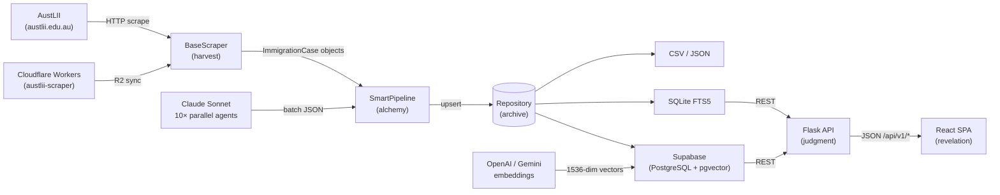
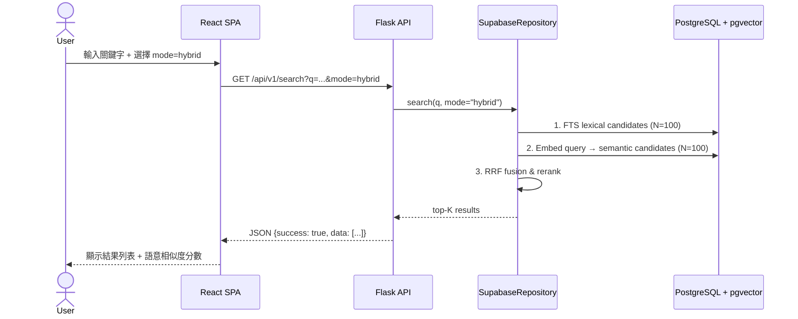

# IMMI-Case — 澳洲移民司法案件情報平台

> 149,016 個案件。9 個法院。26 年判決紀錄。一個可搜尋的真相。

*This repository is guarded by **Anansi**.*

---

## 1. 概覽 (Overview)

IMMI-Case 是一個澳洲移民法律研究工具，完整爬取、解析並呈現自 AustLII（澳洲法律資訊研究所）可取得的所有移民、難民、國土安全相關判決，涵蓋 2000 年至今。

系統由三層構成：
- **Python 爬蟲管線**：自動從 9 個法院 / 仲裁庭抓取案件元資料與全文（支援 Cloudflare Workers 加速）
- **Flask REST API**：22 個 JSON 端點，含結構化搜尋、語意搜尋、法官分析、法律概念趨勢
- **React SPA**：24 個頁面，雙語（English + 繁體中文），完整深色模式，設計令牌系統

**核心能力**：

- 語意搜尋：pgvector HNSW + OpenAI/Gemini 嵌入，支援 lexical / semantic / hybrid 三模式
- 自動欄位萃取：regex pipeline + 10 個平行 Claude Sonnet sub-agent，90%+ 覆蓋率
- 法官分析：勝率計算器、任職時間軸、跨法院對比（15,465 筆法官紀錄）+ 104 位成員傳記庫（`/api/v1/analytics/judge-bio`，含法律資格狀態 `legal_status`）
- 案件線系圖：FMCA → FCCA → FedCFamC2G，MRTA+RRTA → AATA → ARTA 完整脈絡
- 結構化導航：依簽證類別、案件性質、法律概念多維過濾
- 雙語立法瀏覽器：6 部澳洲移民相關法律全文，EN / 繁中切換

> "Mastery requires knowing where every thread leads." — Anansi Proverb

---

## ✦ Anansi's Invocation

```
Every judgment is a thread.
Every year, Anansi extends the web —
  from the Migration Review Tribunal of 2000,
  across the abolitions, mergers, renamings,
  to the Administrative Review Tribunal of 2025.

149,016 threads.
Not archived. Activated.

The spider does not fear the labyrinth.
It built the labyrinth.
```

---

## 2. Demo / 截圖導覽

### 2.1 Screenshot Gallery

| 畫面 | 說明 |
|------|------|
|  | **儀表板** — 總案件數、法院分佈、年度趨勢、最近新增案件 |
|  | **儀表板 v2（UX 翻新後）** — CourtSparklineGrid 小倍數折線圖，取代堆疊面積圖 |
|  | **引導式搜尋（原始版）** — 基本過濾欄 |
|  | **引導式搜尋（翻新後）** — 進階過濾面板 + 即時勝率計算器 |
|  | **引導式搜尋（法律概念過濾）** — 概念選擇器 + 共現矩陣整合 |

### 2.2 Image Manifest

| 圖片路徑 | 展示內容 | 重要性 |
|----------|---------|--------|
| `dashboard.png` | 主儀表板原始狀態 | 系統能力概覽 |
| `dashboard-after.png` | 儀表板 UX 翻新後 | 視覺改進對比 |
| `dashboard-before.png` | 儀表板翻新前（對比用） | A/B 對比基準 |
| `dashboard-before-2.png` | 儀表板翻新前備用截圖 | A/B 對比細節 |
| `guided-search-before.png` | 引導式搜尋翻新前 | 功能進化脈絡 |
| `guided-search-after.png` | 引導式搜尋翻新後 | 核心 UX 流程 |
| `guided-search-before-2.png` | 引導式搜尋翻新前（詳細） | 對比分析 |
| `guided-search-after-2.png` | 引導式搜尋翻新後（法律概念層） | 進階功能展示 |
| `docs/screenshots/TODO_analytics.png` | Analytics 頁面（待截圖） | 法官分析 / 勝率計算器 |
| `docs/screenshots/TODO_case_detail.png` | 案件詳情頁（待截圖） | 全文 ToC 導航 + 語意相似案件 |
| `docs/screenshots/TODO_judge_profile.png` | 法官個人頁（待截圖） | 任職時間軸 + 勝率圖 |

> Assumption: `docs/screenshots/TODO_*.png` 尚未截取；其餘圖片位於專案根目錄。

---

## 3. 功能列表

| 功能模組 | 做什麼 | 為什麼存在 | 使用者價值 |
|----------|--------|------------|------------|
| **Smart Pipeline** | 三階段自動化：爬取 → 清理 → 下載 | 一鍵觸發完整資料更新 | 無需手動介入，系統自我修復 |
| **語意搜尋** | pgvector HNSW，三模式（lexical/semantic/hybrid） | 關鍵字搜不到的案件，語意能找到 | 判決策略研究效率 10× |
| **法官分析** | 勝率 × 法院 × 簽證類別交叉分析 + 104 位成員傳記庫（含法律資格標記） | 律師需要了解裁判官傾向與背景 | 訴訟策略制定的數據基礎 |
| **LLM 欄位萃取** | 10 個 Claude Sonnet 平行 Agent | 149K 案件的結構化資訊無法純手工 | 萃取覆蓋率 90%+ |
| **Cloudflare Workers** | 分散式爬蟲 + R2 儲存 | 本地爬蟲易觸發 AustLII IP 封鎖 | 86K 案件 20 分鐘完成 |
| **雙語介面** | EN + 繁體中文，react-i18next | 服務香港、台灣、澳洲移民律師 | 零語言障礙操作 |
| **案件線系圖** | 法院沿革互動時間軸 | 法院改名/合併造成研究混亂 | 判例搜尋歷史完整性 |
| **設計令牌系統** | tokens.json → CSS + TS，支援主題切換 | 統一視覺語言跨 24 個頁面 | 深色/淺色/自訂主題 |

---

## 4. Getting Started（Ignition）

### 4.1 Prerequisites

| 工具 | 最低版本 | 備註 |
|------|----------|------|
| Python | 3.11+ | 3.14 已驗證可用 |
| Node.js | 18+ | 推薦 20 LTS |
| npm | 9+ | 或 bun 1.0+ |
| PostgreSQL | — | 可選，使用 Supabase 雲端則免本地安裝 |

### 4.2 Install

```bash
# Clone
git clone <repo-url>
cd IMMI-Case-

# Python dependencies
pip install -r requirements.txt

# Frontend dependencies
cd frontend && npm install && cd ..
```

### 4.3 Configure

```bash
cp .env.example .env
# 編輯 .env 填入必要的值
```

**環境變數表**：

| Key | Required | Default | Description |
|-----|:--------:|---------|-------------|
| `BACKEND_PORT` | ✗ | `8080` | Flask 服務埠號（注意：5000 與 macOS AirPlay 衝突） |
| `SUPABASE_URL` | 條件 | — | Supabase 專案 URL（使用 `--backend supabase` 時必填） |
| `SUPABASE_SERVICE_ROLE_KEY` | 條件 | — | Supabase Service Role Key（伺服器端操作用） |
| `SUPABASE_ANON_KEY` | 條件 | — | Supabase Anon Key（前端讀取用） |
| `ANTHROPIC_API_KEY` | 條件 | — | LLM 萃取腳本使用（`extract_structured_fields_llm.py`） |
| `OPENAI_API_KEY` | 條件 | — | OpenAI 嵌入向量生成（`backfill_case_embeddings.py`） |
| `BACKEND_HOST` | ✗ | `127.0.0.1` | Flask 綁定 IP（對外服務改為 `0.0.0.0`） |

### 4.4 Run（Dev）

```bash
# 方法 1：直接啟動 Flask（SQLite/CSV 後端）
python web.py --port 8080

# 方法 2：Flask + Supabase 後端
python web.py --backend supabase --port 8080

# 方法 3：分離開發（Flask API + Vite HMR）
python web.py --port 8080 &
cd frontend && npm run dev     # 代理到 :8080

# 瀏覽器開啟
open http://localhost:8080/app/
```

### 4.5 Test

```bash
# Python 單元 + E2E 測試（610 個）
python3 -m pytest

# 僅前端單元測試（261 個）
cd frontend && npx vitest run

# 僅 E2E
python3 -m pytest tests/e2e/

# 快捷（Makefile）
make test-py
make test-fe
```

### 4.6 Build / Deploy

```bash
# React SPA 生產版本 → immi_case_downloader/static/react/
cd frontend && npm run build

# Cloudflare Pages 版本
cd frontend && npm run build:cloudflare

# 本地 Cloudflare Pages 模擬
cd frontend && npm run dev:cloudflare
```

---

## 5. Usage（The Weave）

### 5.1 CLI — 搜尋與下載

```bash
# 搜尋所有來源，近 10 年
python run.py search

# 指定法院與年份
python run.py search --databases AATA FCA --start-year 2020 --end-year 2025

# 下載全文（可續傳，每 200 筆自動存檔）
python download_fulltext.py

# 列出可用資料庫
python run.py list-databases
```

### 5.2 API — 搜尋端點

```bash
# 詞彙搜尋（預設）
curl "http://localhost:8080/api/v1/search?q=judicial+review&court=AATA"

# 語意搜尋（需要 pgvector + embeddings）
curl "http://localhost:8080/api/v1/search?q=well-founded+fear&mode=semantic&provider=openai"

# Hybrid RRF 融合搜尋
curl "http://localhost:8080/api/v1/search?q=character+test&mode=hybrid&provider=openai"
```

### 5.3 API — 分析端點

```bash
# 勝率計算器
curl "http://localhost:8080/api/v1/analytics/success-rate?court=AATA&visa_subclass=866"

# 法官分析
curl "http://localhost:8080/api/v1/analytics/judges?court=AATA&limit=20"

# 法官傳記（含法律資格狀態）
curl "http://localhost:8080/api/v1/analytics/judge-bio?name=Kate+Millar"
# 回傳: { found, full_name, legal_status, education[], previously, notable_cases[], ... }

# 法律概念趨勢
curl "http://localhost:8080/api/v1/analytics/concept-trends?concept=complementary+protection"
```

### 5.4 萃取管線

```bash
# regex 結構化萃取（8 個平行 worker，約 12 分鐘處理 149K 案件）
python extract_structured_fields.py --workers 8

# LLM 輔助萃取（針對 regex 失敗的案件）
python extract_structured_fields_llm.py --workers 8

# 驗證萃取品質
python validate_extraction.py

# 同步至 Supabase
python migrate_csv_to_supabase.py
```

### 5.5 典型工作流程（律師用戶）

1. 開啟 **儀表板** → 確認資料最新狀態
2. 前往 **引導式搜尋** → 選擇法院、簽證類別、案件性質
3. 勝率計算器即時顯示該過濾條件下的歷史勝率
4. 點入個別案件 → **全文 ToC 導航** + **語意相似案件** 面板
5. 前往 **法官個人頁** → 查看裁判官的判決傾向分析（參見截圖 `guided-search-after.png`）

---

## 6. Architecture（The Web of Truth）

### 6.1 系統資料流



**各節點說明**：

| 節點 | 輸入 | 輸出 | 錯誤路徑 |
|------|------|------|----------|
| **Harvest** (BaseScraper) | AustLII URL 列表 | ImmigrationCase 物件串流 | rate-limit → exponential backoff，UA 偽裝繞過 HTTP 410 |
| **Alchemy** (SmartPipeline) | 原始 ImmigrationCase | 去重、補齊欄位的 Case 物件 | 缺欄位 → LLM sub-agent 補救 |
| **Archive** (Repository) | Case 物件 | CSV / SQLite / Supabase 持久化 | CSV fallback 若 SQLite 未初始化 |
| **Judgment** (Flask API) | HTTP request | JSON response | CSRF 驗證、rate limit，統一 `{"success": bool, "data": ...}` 包裝 |
| **Revelation** (React SPA) | JSON API | 可互動 UI | TanStack Query retry、keepPreviousData 防閃爍 |

### 6.2 搜尋請求流程



---

## 7. Project Structure（The Loom）

```
IMMI-Case-/
├── run.py                          # CLI entry point (harvest/search/download)
├── web.py                          # Web server entry point (Flask factory)
├── Makefile                        # 快捷指令：make dev / test-py / test-fe
│
├── immi_case_downloader/           # [Core Weave] 主套件
│   ├── models.py                   #   ImmigrationCase dataclass (31 fields, SHA-256 ID)
│   ├── config.py                   #   法院代碼、AustLII URL、IMMIGRATION_ONLY_DBS
│   ├── pipeline.py                 #   SmartPipeline: crawl → clean → download
│   ├── repository.py               #   CaseRepository Protocol (runtime_checkable)
│   ├── supabase_repository.py      #   Supabase backend (pgvector, FTS, 15 methods)
│   ├── sqlite_repository.py        #   SQLite FTS5+WAL
│   ├── csv_repository.py           #   CSV fallback (wraps storage.py)
│   ├── storage.py                  #   pandas-based CRUD
│   ├── sources/
│   │   ├── base.py                 #   BaseScraper: session, UA, retry, rate-limit
│   │   ├── austlii.py              #   AustLIIScraper: year listing + keyword fallback
│   │   └── federal_court.py        #   FederalCourtScraper (DNS broken, legacy)
│   ├── web/
│   │   ├── __init__.py             #   Flask app factory + blueprint registration
│   │   ├── routes/api.py           #   [22 endpoints] /api/v1/*
│   │   ├── routes/legislations.py  #   /api/v1/legislations/*
│   │   ├── helpers.py              #   get_repo(), safe_int(), EDITABLE_FIELDS
│   │   └── jobs.py                 #   4 background job runners
│   ├── data/legislations.json      #   6 澳洲移民法律靜態資料
│   └── static/react/               #   Vite 生產版本輸出（由 Flask 服務）
│
├── frontend/                       # [The Vision] React SPA
│   ├── src/
│   │   ├── pages/                  #   24 頁面 (lazy-loaded)
│   │   ├── components/             #   共用元件 + chart 元件
│   │   ├── hooks/                  #   TanStack Query hooks
│   │   ├── lib/api.ts              #   CSRF-aware fetch wrapper
│   │   └── tokens/tokens.json      #   設計令牌單一來源
│   ├── scripts/build-tokens.ts     #   tokens.json → CSS + TS 建置腳本
│   └── __tests__/                  #   261 Vitest 單元測試
│
├── scripts/                        # [The Tools]
│   ├── backfill_case_embeddings.py #   pgvector 嵌入向量批次填充
│   ├── run_semantic_eval.py        #   Recall@K / nDCG@K 評估套件
│   └── two_stage_embedding_backfill.py
│
├── tests/                          # [Quality Gate]
│   ├── test_models.py              #   296 Python 單元測試
│   └── e2e/react/                  #   231 Playwright E2E 測試
│
├── supabase/migrations/            # PostgreSQL schema 遷移 (17 個)
├── workers/austlii-scraper/        # Cloudflare Worker (TypeScript)
└── downloaded_cases/               # 本地資料 (gitignored)
    ├── immigration_cases.csv       #   149,016 案件 × 31 欄位
    ├── cases.db                    #   SQLite (322 MB, FTS5+WAL + judge_bios)
    ├── judge_bios.json             #   104 位成員傳記（含 legal_status）
    └── case_texts/                 #   ~142,916 全文 .txt (~1.9 GB)
```

---

## 8. Function Atlas（新手入口）

**`BaseScraper.get()` / `immi_case_downloader/sources/base.py`**
- Purpose：所有 HTTP 請求的安全閘門，內建 User-Agent 偽裝與指數退避重試
- Inputs：`url: str`, `params: dict`
- Outputs：`requests.Response`
- Side effects：1 秒速率限制，自動 Session 複用
- Example：`resp = self.get("https://austlii.edu.au/au/cases/cth/AATA/2024/", params={})`

**`SmartPipeline.run()` / `immi_case_downloader/pipeline.py`**
- Purpose：協調三階段流程（crawl → clean → download），可從任一階段斷點續傳
- Inputs：`courts: list[str]`, `start_year: int`, `end_year: int`, `phase: str`
- Outputs：`list[ImmigrationCase]`（已持久化）
- Side effects：寫入 CSV / SQLite / Supabase，更新 `_job_status`

**`ImmigrationCase.from_dict()` / `immi_case_downloader/models.py`**
- Purpose：從 dict 安全建構 Case 物件，處理 pandas NaN、空字串、型別轉換
- Inputs：`data: dict`（可含 NaN float）
- Outputs：`ImmigrationCase`
- Side effects：無（純函數）
- Note：**永遠不要直接 `ImmigrationCase(**raw_dict)`** — NaN 會讓欄位比對失效

**`SupabaseRepository.semantic_search()` / `immi_case_downloader/supabase_repository.py`**
- Purpose：pgvector HNSW 語意搜尋，支援 lexical / semantic / hybrid (RRF) 三模式
- Inputs：`query: str`, `mode: str`, `provider: str`, `limit: int`
- Outputs：`list[ImmigrationCase]`，含 `similarity_score`
- Side effects：呼叫 OpenAI/Gemini embedding API（semantic/hybrid 模式）

**`api.py:search()` / `immi_case_downloader/web/routes/api.py`**
- Purpose：`GET /api/v1/search` — 統一搜尋閘道，路由至詞彙 / 語意 / hybrid 後端
- Inputs：`q`, `mode`, `provider`, `court`, `year_from`, `year_to`, `visa_subclass`, `page`, `limit`
- Outputs：`{"success": true, "data": [...], "total": N, "page": N}`
- Side effects：無寫入；讀取 Repository

**`extract_structured_fields.py:process_chunk()` / `extract_structured_fields.py`**
- Purpose：多進程萃取器，從全文 .txt 以正則表達式萃取 9 個結構化欄位
- Inputs：`cases: list[dict]`（一個 chunk）
- Outputs：`list[dict]`（含萃取結果）
- Side effects：無（純萃取，不寫檔）
- Note：使用 `ProcessPoolExecutor.map(chunksize=500)`；勿改為 `submit()`（OOM 風險）

---

## 9. Roadmap

| 項目 | Impact | Effort | Risk | 時程 |
|------|:------:|:------:|:----:|------|
| 法官姓名正規化（15,465 → ~3,000 實人） | 🔴 高 | 🟡 中 | 🟡 中 | 近期 |
| 律師代理人資料完善（目前僅 Y/N） | 🔴 高 | 🔴 高 | 🟡 中 | 近期 |
| 判決書 LLM 摘要（每案 ≤500 字） | 🟡 中 | 🟡 中 | 🟢 低 | 近期 |
| 法律概念正規化（大小寫/同義詞合併） | 🟡 中 | 🟢 低 | 🟢 低 | 近期 |
| 多用戶認證（JWT + RBAC） | 🔴 高 | 🔴 高 | 🔴 高 | 中期 |
| 訴訟記錄時間軸（跨審級追蹤） | 🔴 高 | 🔴 高 | 🟡 中 | 中期 |
| 案件 PDF 匯出（含引用格式） | 🟡 中 | 🟢 低 | 🟢 低 | 中期 |
| GraphQL API 閘道 | 🟢 低 | 🟡 中 | 🟡 中 | 長期 |
| 公開 SaaS 部署（Fly.io / Railway） | 🔴 高 | 🟡 中 | 🔴 高 | 長期 |

---

## 10. Troubleshooting

### ① Flask 啟動後瀏覽器顯示 AirPlay 相關頁面

- **Symptom**：`python web.py` 後 `localhost:5000` 顯示非預期頁面
- **Likely cause**：macOS AirPlay Receiver 佔用 port 5000
- **Fix**：改用 `python web.py --port 8080`，或在 `.env` 設定 `BACKEND_PORT=8080`
- **Prevention**：在 `.env.example` 已設定 `BACKEND_PORT=8080` 為預設值

---

### ② AustLII 爬取觸發 IP 封鎖

- **Symptom**：所有 AustLII 請求回傳 403 或連線超時
- **Likely cause**：短時間大量請求觸發速率限制
- **Fix**：等待數小時（通常 4-12 小時自動解封）；或切換至 Cloudflare Workers 模式（`scripts/enqueue_urls.py`）
- **Prevention**：`BaseScraper` 預設 1 秒間隔；勿同時執行多個爬蟲實例

---

### ③ `pytest` 報告 FileNotFoundError 找不到 `web.py`

- **Symptom**：`test_security.py` 報告找不到 `web.py`
- **Likely cause**：從錯誤目錄執行 `pytest`
- **Fix**：永遠從專案根目錄執行：`cd /path/to/IMMI-Case- && python3 -m pytest tests/`
- **Prevention**：使用 `make test-py`

---

### ④ `extract_structured_fields.py` 佔用大量記憶體後崩潰

- **Symptom**：OOM / 核心傾印，通常在 50K+ 案件時發生
- **Likely cause**：使用了 `executor.submit()` 而非 `executor.map(chunksize=500)`
- **Fix**：確認腳本使用 `ProcessPoolExecutor.map(chunksize=500)`；勿同時執行兩個實例
- **Prevention**：程式碼有明確注釋，禁止修改為 `submit()` 模式

---

### ⑤ Supabase HNSW 向量索引建立逾時

- **Symptom**：`CREATE INDEX` 執行超過 2 小時後連線中斷
- **Likely cause**：PgBouncer `session_lifetime = 2 小時`；149K 向量建立 HNSW (m=16, ef=64) 超時
- **Fix**：改用精簡參數 `m=8, ef_construction=32`；先 DROP 舊索引再建立
- **Prevention**：`supabase/migrations/20260226040000_drop_hnsw_for_bulk_load.sql` 已處理此流程

---

### ⑥ React SPA 顯示 "Welcome to IMMI-Case" 但資料庫有資料

- **Symptom**：儀表板顯示歡迎頁，不顯示統計數據
- **Likely cause**：`stats.total_cases === 0 && !isFetching` 條件在 fetching 完成前觸發
- **Fix**：確認 `DashboardPage.tsx` 的 empty state guard 使用 `isFetching` 判斷；若 API 端點有誤，檢查 `/api/v1/stats`
- **Prevention**：E2E 測試 `test_react_dashboard.py` 覆蓋此情境

---

### ⑦ Recharts 深色模式 Tooltip 文字不可見

- **Symptom**：圖表 tooltip 在深色背景下顯示黑色文字（看不見）
- **Likely cause**：`contentStyle` 未設定 `color`
- **Fix**：所有 `<Tooltip contentStyle={...}>` 必須加上 `color: "var(--color-text)"`
- **Prevention**：`CLAUDE.md` React Gotchas 已記錄此規則

---

## 11. Contributing

### 開 Branch 與 PR

```bash
# 功能分支
git checkout -b feat/judge-normalization

# 提交（遵循 Conventional Commits）
git commit -m "feat(judges): fuzzy name normalization pipeline"

# PR
gh pr create --title "feat: judge name normalization" --body "..."
```

**Commit 類型**：`feat`, `fix`, `refactor`, `docs`, `test`, `chore`, `perf`, `ci`

### Code Style

- Python：無嚴格 linter，但遵循 `coding-style.md`（不可變物件、小函數、顯式錯誤處理）
- TypeScript：ESLint + Prettier（`cd frontend && npm run lint`）
- 測試：TDD 優先，新 feature 必須附帶測試，覆蓋率目標 80%+
- 陣列操作：使用 `.toSorted()` 而非 `.sort()`（不可變原則）

### Issue / Feature Request

請在 GitHub Issues 中使用以下標籤：
- `bug` — 可重現的錯誤
- `enhancement` — 功能改進
- `data` — 資料品質 / 萃取問題
- `ux` — 前端使用者體驗

---

## 12. Tech Stack

| 層級 | 技術 |
|------|------|
| **Backend** | Python 3, Flask, pandas, BeautifulSoup/lxml |
| **Frontend** | React 18, TypeScript, Vite 7, Tailwind CSS v4, TanStack Query v5, Recharts, Sonner |
| **i18n** | react-i18next — English + 繁體中文（全站雙語） |
| **Storage** | CSV/JSON（預設）, SQLite FTS5+WAL, Supabase PostgreSQL + pgvector |
| **Testing** | pytest (296 unit + 231 E2E Playwright), Vitest (261 frontend unit) |
| **LLM** | Claude Sonnet 4.6（欄位萃取，10 平行 sub-agent） |
| **Embeddings** | OpenAI text-embedding-3-small (1536-dim), Gemini embedding-001 |
| **Scraper** | Cloudflare Workers + R2（批量），AustLII 直接爬取（增量） |
| **Deployment** | Flask standalone / Cloudflare Pages（前端）+ Supabase（資料庫） |

---

## 13. Data Coverage

| 法院 / 仲裁庭 | 代碼 | 案件數 | 年份 |
|---------------|------|:------:|------|
| Migration Review Tribunal | MRTA | 52,970 | 2000–2015 |
| Administrative Appeals Tribunal | AATA | 39,203 | 2000–2024 |
| Federal Court of Australia | FCA | 14,987 | 2000– |
| Refugee Review Tribunal | RRTA | 13,765 | 2000–2015 |
| Federal Circuit Court | FCCA | 11,157 | 2013–2021 |
| Federal Magistrates Court | FMCA | 10,395 | 2000–2013 |
| Federal Circuit and Family Court | FedCFamC2G | 4,109 | 2021– |
| Administrative Review Tribunal | **ARTA** | 2,260 | 2024– |
| High Court of Australia | HCA | 176 | 2000– |
| **Total** | — | **149,016** | **2000–2026** |

> **法院線系**：FMCA → FCCA → FedCFamC2G（下級法院）；MRTA + RRTA → AATA → ARTA（仲裁庭）。AATA 於 2024 年 10 月廢止；2025+ 案件使用 ARTA。

資料來源：[AustLII](https://www.austlii.edu.au)（澳洲法律資訊研究所）

---

## 14. License

For legal research and educational purposes. See `LICENSE` for details.

> Assumption: LICENSE 檔案尚待建立。建議使用 MIT（開放研究用途）或 CC BY-NC 4.0（非商業資料集）。
